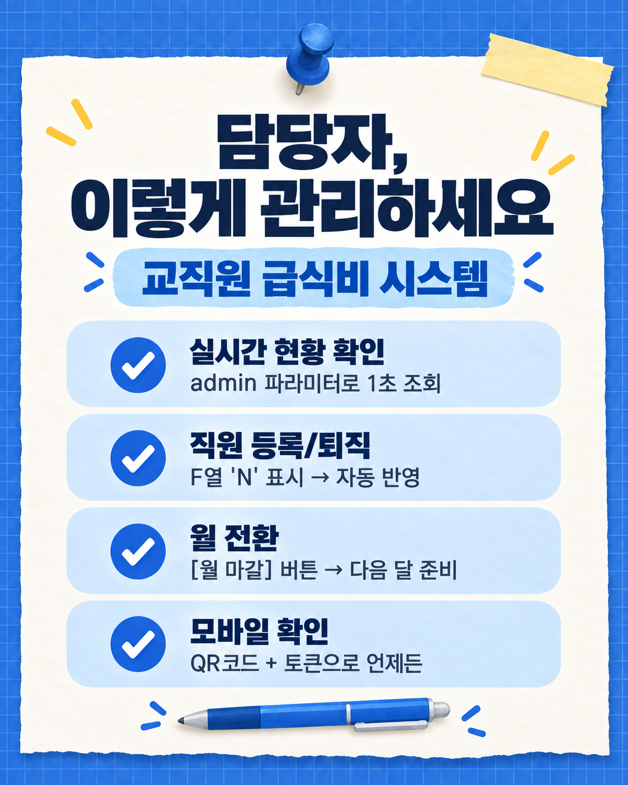

# 교직원 급식 신청 안내

처음 이용하셔도 괜찮습니다. 이 페이지에서 급식 신청 순서, 사용법 영상, 카드뉴스, 담당자 설정 방법을 한 번에 확인할 수 있습니다.

## 구글시트 열기

**[운영 중인 구글시트 열기](https://docs.google.com/spreadsheets/d/1CBCOGmF7Dm8HH3YeOc8BFv46ZEsRgLy-R0XG-SJoXwc/edit?gid=1416788502#gid=1416788502)**

교직원은 시트가 아니라 담당자가 보내 준 **급식 신청 웹 링크**를 이용해 신청합니다. 다른 학교 담당자는 위 시트를 열어 `파일 → 사본 만들기`를 선택한 뒤 아래 설정 안내를 따라 주세요.

## 교직원 신청 순서

1. 담당자가 보내 준 급식 신청 링크를 엽니다. 로그인이나 프로그램 설치는 필요하지 않습니다.
2. `직급 · 성명 선택`에서 본인을 선택합니다. 이름이 없거나 동명이인이 있으면 담당자에게 확인합니다.
3. 급식할 날짜를 누릅니다. 초록색 체크는 선택한 날, 회색은 급식이 없어 선택할 수 없는 날입니다. 별표(*)가 있는 날은 담당자에게 먼저 확인합니다.
4. 선택한 날짜와 예상 급식비를 확인하고 **급식 신청 제출**을 누릅니다. 완료 안내가 나오면 신청된 것입니다.

날짜를 바꾸려면 본인 이름을 다시 선택해 수정하고 제출하세요. 메모는 전달할 내용이 있을 때만 적으면 됩니다. 이메일이 등록된 경우 신청 결과와 급식비 안내 메일이 발송됩니다.

## 학교 담당자용 사용법 영상

아래 영상의 재생 버튼을 누르세요. 화면 안에서 재생되지 않으면 [영상 파일을 새 창에서 바로 열기](https://github.com/user-attachments/assets/278ec6fe-5a55-41af-9471-90992c85c6f1)를 선택하세요.

<video src="https://github.com/user-attachments/assets/278ec6fe-5a55-41af-9471-90992c85c6f1" controls playsinline preload="auto" width="100%"></video>

## 카드뉴스로 보기

카드뉴스 4장을 접지 않고 순서대로 표시합니다.

### 1. 급식비 신청 안내

### 2. 날짜 선택

### 3. 금액 확인

### 4. 담당자 관리

## 다른 학교 담당자: 처음 설정하기

### 1단계. 시트 사본 만들기

위의 구글시트를 열고 `파일 → 사본 만들기`를 선택합니다. 만들어진 사본이 우리 학교의 시트가 됩니다.

### 2단계. 설정 마법사 실행하기

사본 시트에서 상단 메뉴 `급식비 관리 → 처음 시작하기(설정 마법사)`를 선택합니다. 처음 실행할 때 구글 권한 승인 창이 나타나면 본인 계정을 선택하고 안내에 따라 승인합니다. 승인 후 설정 마법사를 다시 엽니다.

학교명, 은행명, 계좌번호, 예금주, 입금기한, 담당자 이메일, 대상 연도·월, 급식단가를 입력한 뒤 **설정 시작**을 누릅니다. 완료 화면의 관리자 토큰은 안전한 곳에 보관하세요.

### 3단계. 교직원 명단 입력하기

시트 아래쪽의 `데이터` 탭에서 교직원의 직급, 성명, 이메일을 입력합니다. 입력을 마치면 `급식비 관리 → 직원 동기화`를 누릅니다. 웹 화면에 처음 접속할 때도 명단이 자동으로 반영됩니다.

### 4단계. 신청 웹페이지 배포하기

1. 시트에서 `확장 프로그램 → Apps Script`를 엽니다.
2. 오른쪽 위 `배포 → 새 배포`를 선택합니다.
3. 배포 유형에서 `웹 앱`을 선택합니다.
4. 실행 계정은 `나`, 액세스 권한은 `모든 사용자`로 설정하고 배포합니다.
5. 권한 승인이 나타나면 승인한 뒤 발급된 웹 앱 주소를 복사합니다.
6. 복사한 주소를 교직원에게 공유합니다.

자동 배포 메뉴는 사본의 구글 설정에 따라 작동하지 않을 수 있습니다. 그때는 위의 `새 배포` 절차를 이용하세요.

## 담당자 운영 방법

### 교직원 추가·퇴직

- 교직원 추가: `데이터` 시트에 새 교직원 정보를 입력한 뒤 `급식비 관리 → 직원 동기화`를 누릅니다.
- 퇴직자: 행을 삭제하지 말고 `데이터` 시트의 재직 여부를 `N`으로 바꾼 뒤 동기화합니다. 기존 신청 기록을 보존할 수 있습니다.

### 다음 달로 변경

`학교급식` 시트의 연도와 월을 직접 고치지 말고 `급식비 관리 → 월 마감(다음 달로 전환)`을 선택합니다. 이번 달 기록을 보관한 뒤 다음 달 신청 화면을 준비합니다.

### 신청 현황 확인

담당자는 웹 앱 주소에 관리자 토큰을 붙여 상세 현황을 볼 수 있습니다. 토큰은 외부에 공개하지 마세요. 분실했다면 `급식비 관리 → 관리자 토큰 재발급`을 선택합니다.

### 테스트 자료 지우기

`급식비 관리 → 제출자료 초기화`를 선택하면 직원별 신청 체크와 제출 기록이 삭제됩니다. 되돌릴 수 없으므로 실제 운영 자료가 아닌 테스트 자료에만 사용하세요.

## 자주 묻는 질문

### 이름이 목록에 없어요

`데이터` 시트에 직급과 성명이 입력되었는지 담당자에게 확인해 주세요. 담당자는 시트에서 `급식비 관리 → 직원 동기화`를 실행할 수 있습니다.

### 날짜를 선택할 수 없어요

회색 날짜는 급식이 없는 날입니다. 별표(*)가 있는 날짜는 담당자에게 확인한 뒤 선택하세요.

### 신청 제출이 되지 않아요

화면에 나온 오류 내용을 확인하고, 페이지를 새로고침한 뒤 다시 제출해 보세요. 계속되지 않으면 담당자에게 문의하세요.

### 신청 메일이 오지 않았어요

신청 화면의 완료 안내가 표시되면 신청은 저장된 것입니다. 이메일 주소가 등록되어 있는지 담당자에게 확인해 주세요.

## 관련 문서

- [전체 사용설명서 원본](3.%EC%82%AC%EC%9A%A9%EC%84%A4%EB%AA%85%EC%84%9C-source.md)
- [디자인 및 화면 설명](DESIGN.md)
- [Apps Script 소스 코드](gas/)
